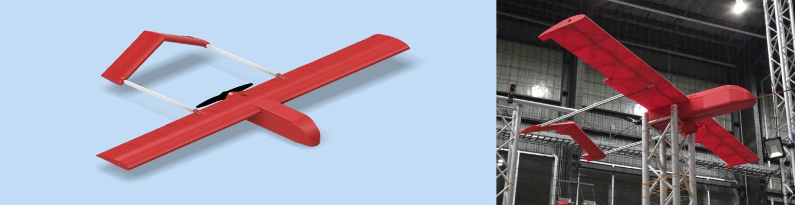

# SWIFT-UAV: Scientific Workhorse for In-flight Field Tests – UAV

SWIFT-UAV  Scientific Workhorse for In-flight Field Tests – UAV

Pelican V0.3 further developed through the Spring of 2026.

## Licensing and Citation

[![CC BY-SA 4.0][cc-by-sa-shield]][cc-by-sa]

This work is licensed under a
[Creative Commons Attribution-ShareAlike 4.0 International License][cc-by-sa].

[cc-by-sa]: http://creativecommons.org/licenses/by-sa/4.0/
[cc-by-sa-image]: https://licensebuttons.net/l/by-sa/4.0/88x31.png
[cc-by-sa-shield]: https://img.shields.io/badge/License-CC%20BY--SA%204.0-lightgrey.svg

Cite as:

@Misc{ARTSLabSwiftUavScientific,     
  author = {{ARTS-L}ab},  
  howpublished = {GitHub},    
  title  = {SWIFT-UAV: Scientific Workhorse for In-flight Field Tests – UAV},    
  groups = {{ARTS-L}ab},    
  url    = {https://github.com/ARTS-Laboratory/SWIFT-UAV},   
  note        = {Accessed: Month dd, yyyy},   
}

QR code for repo.

